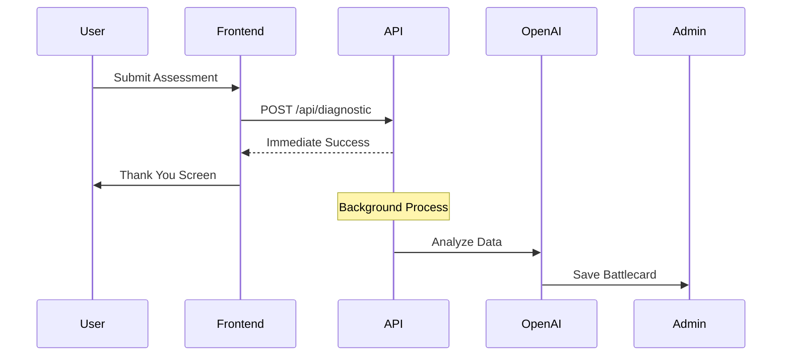

# MonPro-AI Web Platform

Premium Automation Consultancy platform built with Next.js 15, featuring a secure diagnostic pipeline with the "No-Leak" safety lock.

## Quick Start

### 1. Install Dependencies

```bash
npm install
```

### 2. Configure Environment Variables

Create a `.env.local` file in the root directory:

```env
OPENAI_API_KEY=your_openai_api_key_here
NODE_ENV=development
```

**Important:** The OpenAI API key is used only for server-side background processing. It is never exposed to the client.

### 3. Run Development Server

```bash
npm run dev
```

Open [http://localhost:3000](http://localhost:3000) to see the application.

## Architecture

### The "No-Leak" Safety Lock

This application implements a critical security feature where:

1. **User submits questionnaire** → Frontend sends data to `/api/diagnostic`
2. **API returns immediately** → User sees success message instantly (< 200ms)
3. **Background processing** → LLM analysis happens AFTER response sent
4. **Admin-only output** → All AI-generated content goes to admin logs only
5. **Decoupled experience** → User never waits for or sees LLM output



### Tech Stack

- **Framework:** Next.js 15 (App Router)
- **Styling:** Tailwind CSS
- **Animation:** Framer Motion
- **Typography:** Plus Jakarta Sans, JetBrains Mono
- **AI:** OpenAI GPT-4 (server-side only)

### Theme: Deep Obsidian

- Background: `#010409`
- Primary (Cyan): `#00f2ff`
- Secondary (Emerald): `#00ff88`
- Accent (Red): `#ff3e3e`

## Project Structure

```
src/
├── app/
│   ├── api/
│   │   └── diagnostic/
│   │       └── route.ts          # Secure API endpoint
│   ├── layout.tsx                # Root layout with fonts
│   └── page.tsx                  # Landing page (region selector)
├── components/
│   ├── CyanButton.tsx            # Premium button component
│   ├── GlassCard.tsx             # Glassmorphism container
│   ├── RegionCard.tsx            # Tappable region selector
│   └── ThankYouScreen.tsx        # Success confirmation (no LLM)
├── lib/
│   └── theme.ts                  # Theme constants & utilities
├── styles/
│   └── globals.css               # Global styles & utilities
└── types/
    └── index.ts                  # TypeScript definitions
```

## Key Features

### 1. Region Selector

- First interaction gate
- Determines currency (₹, €, £)
- Mobile-first, highly tappable design

### 2. Secure Diagnostic API

- Immediate response to frontend
- Background LLM processing
- Robust error handling with try/catch
- Fallback battlecard if AI fails

### 3. Premium UI/UX

- Atmospheric cyber-stealth aesthetic
- Smooth Framer Motion animations
- Glassmorphism and neon glows
- Optimized for mobile (320px+)

## Security Notes

- ✅ API keys stored in `.env.local` (gitignored)
- ✅ All OpenAI calls are server-side only
- ✅ Frontend never receives LLM output
- ✅ User experience decoupled from AI processing
- ✅ Graceful fallback if AI fails

## Development Guidelines

1. **Never expose API keys** to client-side code
2. **Always return success** to user, even if backend fails
3. **Background processing only** for LLM analysis
4. **Mobile-first approach** for all UI components
5. **Premium feel** - smooth animations, proper spacing, tactile feedback

## Build & Deploy

```bash
# Production build
npm run build

# Start production server
npm run start
```

## License

Proprietary - MonPro-AI © 2025
